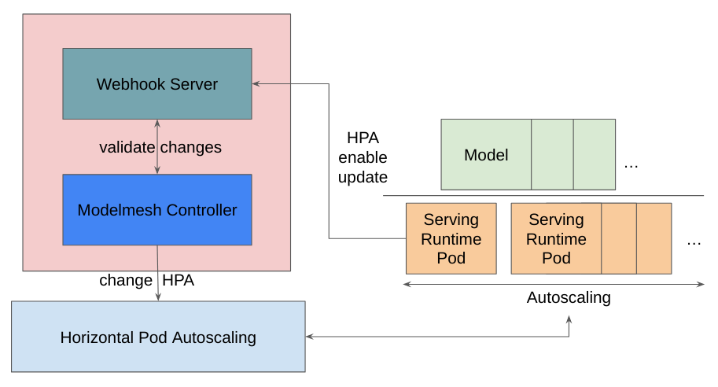

# Quick Start - Sample Model Deployment and Autoscaler

Welcome to the quick start for the Sample Model Deployment and the Horizontal Pod Autoscaler (HPA). [HPA](https://kubernetes.io/docs/tasks/run-application/horizontal-pod-autoscale/) is a default object provided by Kubernetes. ModelMesh relies on the HPA object to autoscale the ServingRuntime pods.

<p align="center">
  
</p>

By design, multiple models in a ModelMesh share a single ServingRuntime. Therefore, you manage HPA-specific features through ServingRuntime annotations. (This differs from how you manage kserve/kserve through annotations or predictor specs in an inference service.)

## Prerequisites

- Verify that you meet the requirements for running the quick starts listed in [Overview of the OpenDataHub's ModelServing Quick Starts](../README.md).
- Install OpenDataHub ModelServing as described in [Installing OpenDataHub ModelServing](../common_docs/modelmesh-install.md).

## Deploy a Sample Model

1. Deploy the sample model:

```
./deploy.sh
```

The `deploy.sh` script deploys a sample model and includes an inference service.

2. Check the model deployment status, as described in [Check the model deployment status](../basic/README.md#check-model-deployment-status).

## Perform an inference request

**Curl test without authentication enabled**

```
export HOST_URL=$(oc get route example-onnx-mnist -ojsonpath='{.spec.host}' -n ${TEST_MM_NS})
export HOST_PATH=$(oc get route example-onnx-mnist  -ojsonpath='{.spec.path}' -n ${TEST_MM_NS})

curl   --silent --location --fail --show-error --insecure https://${HOST_URL}${HOST_PATH}/infer -d  @${COMMON_MANIFESTS_DIR}/input-onnx.json
```

**gRPC Curl test without authentication enabled**

```
kubectl port-forward --address 0.0.0.0 service/modelmesh-serving 8033 -n ${TEST_MM_NS}

cd ${COMMON_MANIFESTS_DIR}

grpcurl \
  -plaintext \
  -proto ./proto/grpc_predict_v2.proto \
  -d "$(envsubst <grpc-input-onnx.json )" \
  localhost:8033 \
  inference.GRPCInferenceService.ModelInfer

cd -
```

## HPA Feature Test

The `deploy.sh` script enabled the HPA feature.

Verify that HPA has been created:

```
oc get hpa
```

### Use Cases

The following commands illustrate uses cases for the HPA feature.

**Enable Autoscaler**

```
oc annotate servingruntime ovms-1.x serving.kserve.io/autoscalerClass=hpa
```

**Disable Autoscaler**

```
oc annotate servingruntime ovms-1.x serving.kserve.io/autoscalerClass-
```

**Change Max pods**

```
oc annotate servingruntime ovms-1.x serving.kserve.io/max-scale=3
```

**Change Min pods**

```
oc annotate servingruntime ovms-1.x serving.kserve.io/min-scale=2
```

**Change targetUtilizationPercentage**

```
 oc annotate servingruntime ovms-1.x  serving.kserve.io/targetUtilizationPercentage=50
```

**Change metrics type**

```
oc annotate servingruntime ovms-1.x serving.kserve.io/metrics=memory
```

## Cleanup

Follow the steps in [Cleaning up an OpenDataHub ModelServing installation](../common_docs/modelmesh-cleanup.md).
